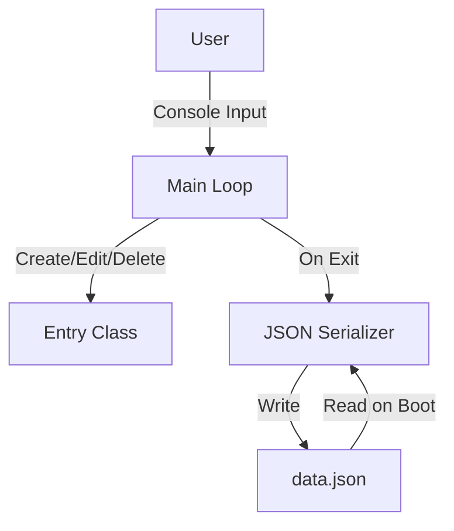

# Developer & Technical Documentation

This document provides a technical guide to the **To-DoList** application's architecture and execution.

---

## System Architecture

The application is a standard C# console application utilizing `System.Text.Json` for serialization.



---

## Directory Structure & File Roles

```
.
├── main.cs             # Core application code, logic, and Entry models
├── To-DoList.csproj    # C# Project definition
├── data.json           # Serialized task list (generated on first save)
├── README.md           # General overview
└── Documentation.md    # Technical documentation
```

---

## Workflow

The execution flow of To-DoList:
1. **Initialization**: On boot, the `ListSaveLoad.LoadList` reads `data.json` and parses it into a `List<Entry>`.
2. **Action Trigger**: The main loop presents a numbered menu.
3. **Processing**: Switch cases handle state mutation (e.g., calling `ToggleCompleted()`, `ChangeDescription()`, or list removals).
4. **Output Generation**: State is rendered to the console iteratively. Upon selecting exit (Option 7), `ListSaveLoad.SaveList` serializes the current state back to `data.json`.

---

## Launcher Compilation Guide

If you need to compile or run the To-DoList executable, use the standard .NET CLI.

### Compilation or Execution Commands

Execute the following commands in order within your terminal:

```powershell
# Build for release
dotnet build -c Release

# Run directly during development
dotnet run
```
